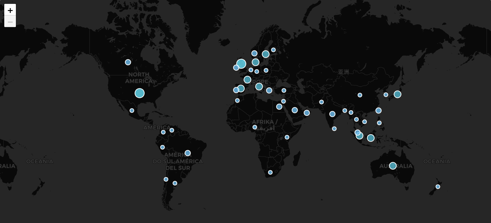
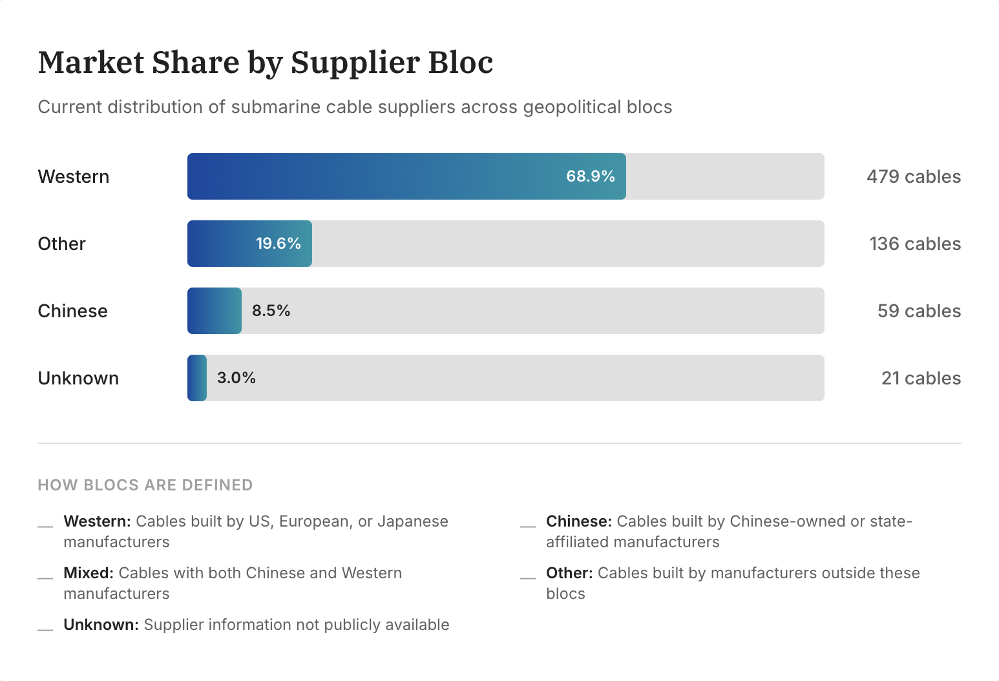
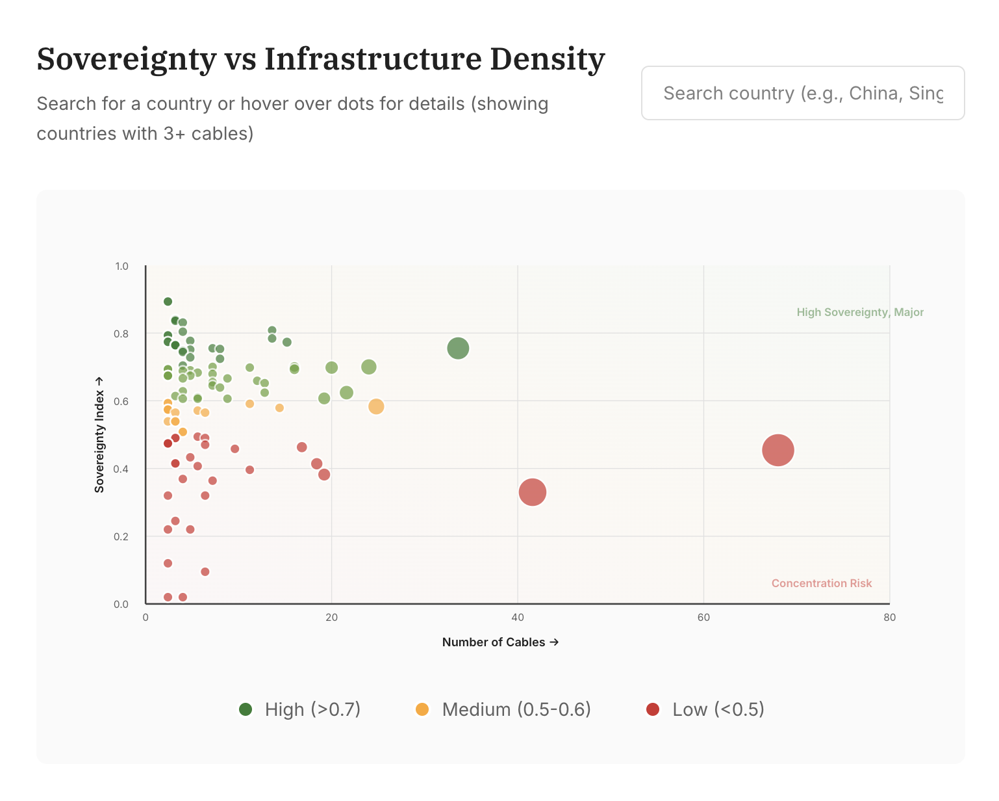
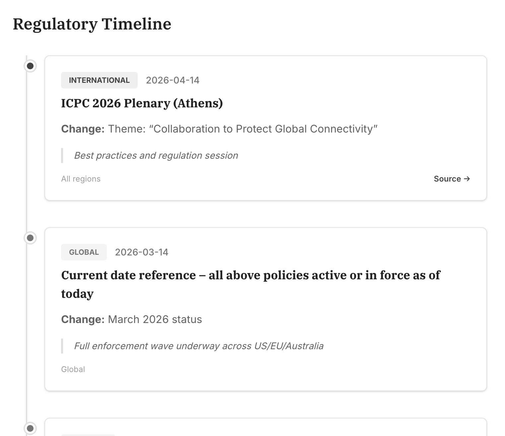

# Global Digital Infrastructure Political Economy Observatory

**An open-source research platform mapping the political economy of global digital infrastructure, starting with the world's submarine cable network.**

🔗 **Live dashboard:** https://research-platform-sand.vercel.app/



## Overview

The Global Digital Infrastructure Political Economy Observatory is a public research platform that tracks the physical and regulatory backbone of the global internet. It pairs a continuously updated dataset with an interactive dashboard so that researchers, policymakers, journalists, and the public can explore who owns, builds, and governs critical digital infrastructure.

Phase 1 focuses on **submarine communications cables** (the network of undersea cables that carries the overwhelming majority of international internet traffic), together with the **policies and regulations** that shape it. The same analytical framework is designed to extend to 5G networks and data centers in later phases.

The project is developed at Northeastern University as part of ongoing research on technology, security, and society. It is built to be transparent and reproducible: the data pipeline, the review process, and the dashboard are all open.

## Motivation

Almost all international internet traffic travels through submarine cables, and the data centers that AI depends on sit on the same physical foundation. Ownership and supply of that infrastructure are concentrated among a small number of firms and states, which has made it a question of national security and economic competitiveness, not only connectivity.

Existing public sources show where cables are and who operates them. Very few show the ownership and supply structure behind them, and fewer still track how quickly the surrounding regulation is changing. This project exists to close that gap: to make the political and economic structure of critical digital infrastructure visible, current, and open for others to use and build on.

## What it tracks

- **Submarine cables:** nearly 700 cables with ownership, suppliers, landing countries and stations, length, operational status, and supplier/owner "bloc" classifications.
- **Policy & regulation:** a timeline of regulatory events from 1884 to the present, spanning the US, EU, and other jurisdictions, each linked to how it affects cable infrastructure.
- **Geopolitical structure:** sovereignty and dependency measures derived from ownership and landing-point data.

## Screenshots

A few views from the dashboard.

**Market share by supplier bloc**



**Sovereignty vs infrastructure density**



**Regulatory timeline**



## How it works

The dataset stays current through an AI-assisted pipeline with a human review gate. In outline:

**Web sources → AI extraction → enrichment & validation → deduplication → human review → database → dashboard**

1. **Discovery:** Perplexity searches public sources for recent cable announcements and policy developments.
2. **Extraction:** Claude reads the raw source material and pulls out structured records (cable name, owners, suppliers, landing points, dates, and so on).
3. **Enrichment & validation:** a second Claude step standardizes fields, classifies ownership and supplier blocs, and checks records for internal consistency.
4. **Deduplication:** each new record is checked against existing data so the same cable or event is never added twice.
5. **Human review:** proposed records land in a staging sheet where a researcher approves, edits, or rejects them before anything reaches the live dataset.
6. **Database:** approved records are written to the project database.
7. **Dashboard:** the public dashboard reads directly from the database, so approved updates appear without a redeploy.

This keeps the dataset fresh while ensuring a human signs off on every record that goes live. A multi-model cross-check (having two independent models extract the same record and flagging disagreements for review) is being added as a further data-quality safeguard.

## Tech stack

| Layer | Technology |
|-------|-----------|
| Frontend | React, Vite, Tailwind CSS (deployed on Vercel) |
| Database | Supabase (PostgreSQL) |
| Automation | Make.com |
| AI / extraction | Claude (Anthropic), Perplexity |
| Human review | Google Sheets |

## Getting started

The dashboard is a standard Vite + React application.

```bash
# clone the repo
git clone [INSTITUTIONAL GITHUB URL, PLACEHOLDER, PENDING TRANSFER].git
cd submarine-cable-observatory

# install dependencies
npm install

# start the dev server
npm run dev
```

Other scripts: `npm run build` (production build), `npm run preview` (preview a build), and `npm run lint`.

**Configuration.** The app connects to a Supabase project using a project URL and a public anon key, currently set in `src/lib/supabase.js`. For public/open-source use, move these into a `.env` file (Vite reads `VITE_`-prefixed variables) and commit a `.env.example` so contributors know what to set. Only the public anon key belongs in the frontend, and only when the database has row-level security enabled. Never commit the Supabase service role key or any other secret.

## Roadmap

A short summary is below; see [`roadmap.md`](roadmap.md) for the full version.

- **Now:** keep the submarine cable and policy datasets live and current; add multi-model extraction cross-checks for data-quality confidence.
- **Next:** public website, contributor documentation, and data-coverage reporting.
- **Later (Phase 2+):** extend the framework to 5G and data center infrastructure.

## Documentation

Fuller documentation lives alongside the code in this repository.

- [Data Dictionary](DATA_DICTIONARY.md) defines every variable in the dataset and every dashboard indicator.
- [Workflow Documentation](WORKFLOW_DOCUMENTATION.md) describes how a record moves from discovery to the dashboard, and the quality-control steps along the way.
- [Governance Framework](GOVERNANCE_FRAMEWORK.md) explains how the project is maintained and how data quality is kept over time.
- [Contributing guide](CONTRIBUTING.md) lays out the ways people outside the team can take part.
- [Roadmap](roadmap.md) describes where the project is today and where it is going.
- [Deliverables Index](DELIVERABLES_INDEX.md) lists every project deliverable and where to find it.

## Contributing

Contributions are welcome, including data corrections. See [`CONTRIBUTING.md`](CONTRIBUTING.md) for how to get involved, report an issue, or suggest a change.

## Team

Developed at Northeastern University.

- **Prof. Kellee Tsai:** Principal Investigator; Dean of the College of Social Sciences and Humanities and Distinguished Professor of Political Science, Northeastern University
- **Prof. Xiaoxiao Shen:** Co-Principal Investigator; Assistant Research Professor of Political Science, Northeastern University
- **Anthony Chan:** Research Assistant (current)

## Contact / beta access

Interested in using the platform or joining as a beta user? Sign up here: https://docs.google.com/forms/d/e/1FAIpQLSfKs-Woma7qoMD5hFfk6ZhdWdFokj8UIBOWfYFQwtt0KnRuLw/viewform

To share feedback or report a problem, use the [feedback form](https://docs.google.com/forms/d/e/1FAIpQLSe4hQcIMxplSJR44xBjhGSWRCcukj8hlWhWNH8WxJS8C5xj9g/viewform) or open a GitHub issue.

## License

This project is open source. The code is released under the [MIT License](LICENSE), and the dataset is released separately under a Creative Commons Attribution 4.0 International (CC BY 4.0) license.
